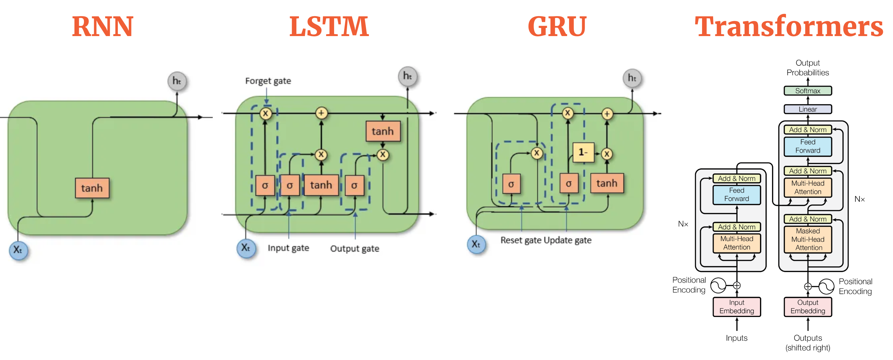
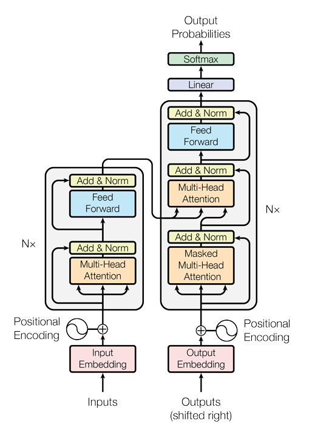
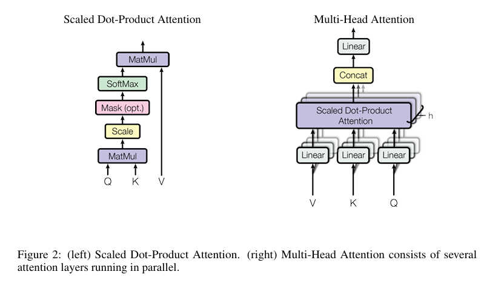

---
title: Attention is all you need and much more
date: 2025-2-15 22:00:00 +0700  
last_modified_at: 2025-02-18 22:00:00 +0700
categories: [Learning, Paper]  
tags: [en, beginner, reading-paper, llm, ai-learning]  
description: In-depth analysis of transformer.
author: BFC  
image:  
  path: assets/local/transformer.png
math: true

# render_with_liquid: false  
# toc: false  
comments: true  
---  
> This post contains many subjective opinions based on my personal research and understandings, so please take it with a grain of salt.

## Introduction

AI is everywhere right now, isn't it? It feels like every day there's a new mind-blowing model or application making headlines. It's easy to get caught up in the hype, the "AI FOMO" as some call it. But if you're serious about actually understanding this AI revolution, you need to go deeper than just the surface. You need to grasp the core concepts that power these breakthroughs. And when it comes to modern AI, especially in language and vision, one concept stands tall: Attention. Today, we're going back to the source, the paper that arguably started it all: "Attention is All You Need." Get ready for an in-depth exploration of the Transformer architecture.

## Attention Is All You Need

> In the following parts, I will follow the structure of the paper, breaking down the key components and concepts.

### Introduction
- For years, Recurrent Neural Networks – especially LSTMs and GRUs – reigned supreme in the world of sequence modeling tasks like language translation. 
> Familiarity with these models will be beneficial before diving into this paper

- However, these RNN-based models had a fundamental bottleneck: their inherent sequential nature. Processing information step-by-step, word-by-word, made it difficult to truly parallelize training, especially when dealing with longer sequences. 
- Attention mechanisms have become essential for sequence modeling and transduction, allowing the modeling of dependencies regardless of their distance in the input or output sequences.
- In most cases, attention mechanisms are used in conjunction with a recurrent network.
- This work proposes the **Transformer** model, which **avoids recurrence** and **relies entirely on an attention mechanism** to establish global dependencies between input and output.
{: width="650" .normal}

**Explanation**

**RNN**:

+ Imagine you have a friend who helps you read. This friend is a bit slow. They read the book word by word, from the very first word to the very last word. They have to read each word before they can understand the next one.
+ If the book is super long, it takes your friend a very long time to read it. 
+ It's hard for your friend to remember what happened at the beginning of the book when they are reading the end. 

**Transformer**:
+ Now, imagine you have a super helper! This helper has a magic magnifying glass. When you're reading a sentence, this magnifying glass can quickly jump around and look at the most important words in the sentence, even if they are far apart.
+ This helper is like having lots and lots of magnifying glasses all at once! They can look at all the words in the sentence (or even the whole book!) at the same time and figure out which words are important and how they are all connected to each other.
+ That means: *Super Fast!* *No more forgetting!*

### Model Architecture
Now let's dive into the architecture. Refer to the diagram below to get a sense of the model's structure, which I will explain in detail in the following sections.
{: height="200"}

#### Encoder-Decoder Architecture
+ The Transformer uses a **stacked encoder-decoder** structure. Both the encoder and decoder are made up of multiple layers (six in this case).
+ Each encoder (the left one in the image) layer consists of two sub-layers: a **multi-head self-attention** mechanism and a position-wise fully connected feed-forward network.
+ The decoder (the right one in the image) layers include an additional sub-layer for **attention over the encoder’s output**, alongside the same two sub-layers present in the encoder.

##### Simple Explanation

+ **The Encoder and Decoder**: Think of the encoder as a "reader" that understands the sentence in one language and creates a representation of it. The decoder is like a "writer" who uses that representation to generate the sentence in another language.

+ **Attention**: The model looks at all the words in a sentence at once and decides which words are most important for understanding the meaning. For example, when translating the word "dog," it might pay extra attention to the word "bark" because dogs bark. This is the "attention" mechanism!

+ **Multi-Head Attention**: The model has multiple "heads" or sets of eyes that look at the sentence in different ways at the same time. This helps it understand various aspects of the sentence. For example, one head might focus on "dog," another on "bark," and a third on "pet," allowing the model to gather more complete information.

+ **Attention over the Encoder's Output**: The decoder doesn't just blindly generate words; it looks back at the encoder’s output to ensure it has all the relevant information from the input sentence. This is like checking the original sentence to ensure it hasn't missed any important details when translating.

##### How the input and output are **actually** processed in the encoder and decoder
> Please refer to the image above as you read this section.

Let's call the input sequence is x. It will be passed through the encoder first.

##### **Encoder Processing**:

- **Encoder Input**: $$ x $$
- **Step 1: Multi-Head Attention**: $$ x $$ passes through a multi-head attention layer, resulting in $$ x_0 $$. ($$ x_0 $$ has the same dimensions as $$ x $$)
- **Step 2: Residual Connection & Layer Normalization**:
  - Add $$ x_0 $$ to the original input $$ x $$.
  - Apply Layer Normalization to the result. Let's call this output $$ x_1 $$.
- **Step 3: Feed-Forward Network**: $$ x_1 $$ passes through a position-wise feed-forward neural network, resulting in $$ x_2 $$.
- **Step 4: Residual Connection & Layer Normalization**:
  - Add $$ x_2 $$ to the input of this sub-layer, $$ x_1 $$.
  - Apply Layer Normalization to the result. Let's call this output $$ x_3 $$.
- **Repeat**: Steps 1-4 are repeated $$ N = 6 $$ times (N is the number of layers in the encoder).
- **Encoder Output**: After $$ N $$ layers, we obtain the encoder's output, which is called $$ e $$ (context-rich representation).

##### **Decoder Processing**:

- **Decoder Input**: $$ y $$ (target sequence)
- **Step 1: Masked Multi-Head Attention**: $$ y $$ passes through a masked multi-head attention layer, resulting in $$ y_0 $$. ($$ y_0 $$ has the same dimensions as $$ y $$)
- **Step 2: Residual Connection & Layer Normalization**:
  - Add $$ y_0 $$ to the original input $$ y $$.
  - Apply Layer Normalization to the result. Let's call this output $$ y_1 $$.
- **Step 3: Multi-Head Attention over Encoder Output**: $$ y_1 $$ passes through a multi-head attention layer that attends to the encoder's output $$ e $$, resulting in $$ y_2 $$.
- **Step 4: Residual Connection & Layer Normalization**:
  - Add $$ y_2 $$ to the input of this sub-layer, $$ y_1 $$.
  - Apply Layer Normalization to the result. Let's call this output $$ y_3 $$.
- **Step 5: Feed-Forward Network**: $$ y_3 $$ passes through a position-wise feed-forward neural network, resulting in $$ y_4 $$.
- **Step 6: Residual Connection & Layer Normalization**:
  - Add $$ y_4 $$ to the input of this sub-layer, $$ y_3 $$.
  - Apply Layer Normalization to the result. Let's call this output $$ y_5 $$.
- **Repeat**: Steps 1-6 are repeated $$ N = 6 $$ times.

Note that: all **x**'s have the same dimension, all **y**'s have the same dimension.

**Key Terms**:
+ Multi-Head Attention: will be explained in the next section. 
+ Layer Normalization: normalizing the output of each layer. Layer normalization helps to manage the internal covariate shift during training, which refers to the change in the distribution of inputs to layers as the model learns. (I recommend to search for it if you don't know about it)
+ Residual connection: a shortcut that allows the output of a layer to bypass the normal processing and be added directly to the output of the layer. This technique, proposed in residual networks (ResNets), is vital for preventing the vanishing gradient problem in deep networks and allowing for easier training.
+ Masked Multi-Head Attention: will be explained in the next section. 
+ Attention over the Encoder's Output (Decoder): will be explained in the next section.

#### Attention Mechanism
This part will explain all the key terms from the previous section. This is the core of the Transformer model, so pay close attention!

##### Dot-Product Attention

Imagine you're trying to figure out how much attention each word in a sentence should pay to every other word. Each word is represented by a vector (a list of numbers), and you want to measure how "relevant" one word is to another.

- **The Query** ($$Q$$) represents the word you're currently focusing on.
- **The Key** ($$K$$) represents all other words that might help provide context for the word you're focusing on.
- **The Value** ($$V$$) represents the information you want to extract from each word.

The idea behind **dot-product attention** is simple: You compute how much the **query** matches with the **key** by calculating their **dot product** (a mathematical operation that measures how aligned two vectors are). If the query and key are similar, it means the word is relevant to what you're currently focusing on.

- The **dot product** between the query $$Q$$ and each key $K$ gives a **similarity score**: 
  $$
  \text{Similarity}(Q, K) = Q \cdot K
  $$
- The higher the score, the more relevant that key (and its corresponding value) is to the query.

So, after calculating the dot products, you would use them as **weights** to take a weighted sum of the values $$V$$. This weighted sum is the **output of the attention mechanism**, which tells you which words are most important for understanding the word you're focusing on.

##### Scaled Dot-Product Attention

Now, the problem with just using the **dot product** of the query and key is that, as the **dimensionality** of the vectors (the size of the query/key vectors) increases, the dot product grows larger. This can cause some issues:

- **Large values in the dot product** lead to **sharp gradients** in the softmax function (which is applied to the attention scores to normalize them). This can cause the softmax to become "too extreme", making the model less stable during training.
  
To fix this, the authors **scale** the dot product by dividing it by the square root of the dimension of the key vectors, $$\sqrt{d_k}$$, where $$d_k$$ is the size of the key vectors. The **scaling** makes sure that the values stay in a reasonable range and prevents the softmax from saturating too quickly.

So the **scaled dot-product attention** is:

$$
\text{Attention}(Q, K, V) = \text{softmax}\left(\frac{QK^T}{\sqrt{d_k}}\right) V
$$

- By dividing the dot product by $$\sqrt{d_k}$$, we ensure that the similarity scores don't grow too large and the softmax function behaves more smoothly.

##### Multi-Head Attention

While scaled dot-product attention is great for focusing on relevant words, **multi-head attention** takes this a step further by **looking at the sentence from multiple perspectives** at once. Instead of having just one "set of eyes" (one set of queries, keys, and values), you create several different sets (or "heads") that each look at the sequence in their own unique way.

- **Why multiple heads?**
  - Each attention head can learn to focus on different relationships between words. For example, one head might learn to focus on word order, another might focus on syntactic structures, and another might focus on semantic meaning. By combining all of these different heads, the model can capture more complex patterns in the data.

- **How does it work?**
  - First, we **project** the query, key, and value vectors into **multiple subspaces** (using learned weights), so that each attention head has a unique view of the information.
  - Then, each attention head computes its own attention using the scaled dot-product attention method.
  - Finally, the outputs of all the heads are **concatenated** together and projected back into the original space.

Mathematically, this looks like:

$$
\text{MultiHead}(Q, K, V) = \text{Concat}(\text{head}_1, \dots, \text{head}_h) W^O
$$

Where each head $$i$$ is:

$$
\text{head}_i = \text{Attention}(QW_i^Q, KW_i^K, V W_i^V)
$$

- $$W_i^Q$$, $$W_i^K$$, and $$W_i^V$$ are learned projection matrices that project the query, key, and value vectors for each head into different subspaces.
- The results from each head are concatenated and then projected back into the original space using $$W^O$$.

##### **Applications of Attention in the Transformer**

In the Transformer, attention is used in three different ways:

1. **Self-Attention in the Encoder**: In each encoder layer, **self-attention** allows each token to attend to all other tokens in the same input sequence. This allows each token to gather information from the entire sequence, regardless of their position.

2. **Self-Attention in the Decoder**: In the decoder, **self-attention** works similarly but is modified to prevent attending to future tokens during training. This masking ensures that the decoder generates the output in an autoregressive manner, relying only on previously generated tokens when predicting the next token.

3. **Encoder-Decoder Attention**: The decoder also has an additional layer of attention that allows each token in the decoder to attend to all tokens in the encoder’s output. This ensures that the decoder can use the context from the encoder (which processes the input sequence) to generate the target sequence.

#### Look back at how the input and output are processed in the encoder and decoder

> Make sure you've grasped the previous section on Attention Mechanisms before proceeding.

Okay, now we know what attention is. Let's look back at how the input and output are processed in the encoder and decoder and explain the key aspects from the previous section.

In the **encoder**, $$x$$ will go through a **multi-head attention** mechanism first. Now, we can understand this better:

- For each value in $$x$$, say $$x[i]$$ (remember that $$x$$ is just a vector), $$x[i]$$ will learn from other $$x[j]$$ (also itself). This means that $$x[i]$$ can attend to every other word in the sequence (including itself) and decide how much attention it should pay to each word. In simpler terms, it is **self-attention**, where each word gathers context from every other word in the sequence.

  This process of **attention** allows the model to focus on the most relevant parts of the sequence to understand the meaning of $$x[i]$$. For example, if $$x[i]$$ is the word "dog", it might focus more on "bark" and less on a word like "a". This happens because the **attention mechanism** computes a score for each word, which determines how much focus $$x[i]$$ should put on other words. The result is a **weighted sum of the values**, which is $$x_0$$.

- **Multi-Head Attention**: The advantage of **multi-head attention** is that it doesn't just focus on one interpretation of the context. Instead, it has multiple "heads", each of which looks at the data from a different angle. So, one head might focus on syntactic relations (like subject-verb agreement), another might focus on semantic relations (like understanding which objects "bark"), and yet another might focus on positional relationships. After all these heads have processed the input in parallel, their outputs are combined to form a richer understanding.

- The **residual connection** ensures that the original input information isn't lost and stabilizing the learning process. After this, **Layer Normalization** is applied to normalize the output, ensuring smoother and more efficient training.

Now, let’s move to the **decoder**. The target sequence $$y$$ is passed through the first sub-layer, which is a **masked multi-head attention mechanism**:

- For each value in $$y$$, say $$y[i]$$, the **masked multi-head attention** ensures that $$y[i]$$ can attend to all previous positions in the sequence, but not to future ones. This is crucial because we are generating the output sequence one token at a time, so $$y[i]$$ must only depend on the previous tokens and not on the ones that come after. This masking prevents the model from cheating by looking ahead at the future tokens and ensures that the model generates each token in an autoregressive manner.

- The **multi-head attention** in the decoder works similarly to the encoder's attention, allowing $$y[i]$$ to attend to all previous positions in the output sequence and gather context. But this time, we are working with a target sequence, and each token in the sequence is dependent on the ones before it. Once this attention is computed, it results in $$y_0$$, and the same **residual connection** and **Layer Normalization** are applied to stabilize the training and retain the original information.

- In the next sub-layer of the decoder, **multi-head attention over the encoder’s output** is performed. Here, each $$y[i]$$ will attend to all the words in the encoder's output $$e$$, which contains the context from the input sequence. This means that for every word in the target sequence, the decoder looks back at the entire input sequence (processed by the encoder) to gather relevant information. For example, if the target word is "chien" (French for dog), the decoder might attend to the word "dog" in the encoder’s output.

- Subsequently, we have the **residual connection** and **Layer Normalization** after this attention step.

- Finally, $$y$$ (after all attention steps) is passed through a **feed-forward neural network**, where each token in $$y$$ is processed independently. This step adds further non-linearity and complexity to the model, which is important for learning complex patterns. The output is again subjected to **residual connection** and **Layer Normalization**.
#### Position-wise Feed-Forward Networks

We've seen how the attention mechanism allows the Transformer to understand the relationships between words in a sequence, essentially capturing the context for each word. Now, after this contextual understanding, each word's representation undergoes further, individual processing. This is where **Position-wise Feed-Forward Networks** come into play.

Think of it this way: Following the attention mechanism, which has enriched each word's representation with contextual information, we now apply a dedicated processing step to each word individually. Imagine each word in the sentence being passed through its own specialized, small neural network – a dedicated processor for that specific position.

$$FFN(x) = max(0,xW_1 +b_1)W_2 +b_2$$

**What do these position-wise networks do?**

+ **Two-Layer Structure** and **ReLU**
+ **Position-wise Operation**: The key here is "position-wise." This means that for each position in the input sequence, we apply the same feed-forward network. However, importantly, this network operates independently at each position within a given layer. While attention established connections between positions, these networks work on each position in isolation, after the contextualization by attention.
+ **Adding Transformation Complexity**: Why are these position-wise networks necessary after attention? Attention is excellent at capturing contextual dependencies. However, the feed-forward networks provide an additional layer of transformation and feature extraction at each position. They allow the model to learn more sophisticated features and representations from the contextually informed word embeddings, going beyond just the relational understanding provided by attention.
#### Embeddings and Softmax

**Embeddings: Turning Words into Vectors**

+ **Word as Index**: Imagine you have a giant dictionary of all the words your model knows (its vocabulary). Each word in this dictionary gets assigned a unique index, like a number in a phone book. For example, "dog" might be index 100, "run" index 250, "quickly" index 5000, and so on.

+ **From Index to Vector**: Now, for each word index, we want to create a meaningful numerical vector. This vector is called an embedding. Think of an embedding as a "coordinate" for each word in a high-dimensional space. Words that are semantically similar (meaning they are related in meaning) should ideally be located closer to each other in this space.

+ **Learned Representation**: These word embeddings aren't just randomly assigned. They are learned during the training process. Initially, they might start as random vectors. But as the Transformer learns from massive amounts of text data, it adjusts these embedding vectors so that they capture the nuances of word meaning and relationships. Words used in similar contexts will gradually have embeddings that are closer together.

**Softmax: From Vector to Word Probabilities**
+ **Decoder Output Vector**: After the decoder has processed the input and generated a representation for the next word it wants to predict, it ends up with a final output vector. This vector is a rich, contextualized representation, but it's still just a vector of numbers.
+ **Linear Transformation**: First, this decoder output vector is passed through a linear transformation. You can think of this as another layer that prepares the vector for the final step.
+ **Softmax Function**: Then comes the Softmax function. This is the crucial step that turns the output vector into a probability distribution over the entire vocabulary. Softmax takes the vector and:
  + Exponentiates each element, making all values positive.
  + Normalizes these exponentiated values so that they all sum up to 1.

**Shared Embeddings and Weights (Efficiency)**

Weight Sharing: The original Transformer paper also mentions a clever trick: they share the weight matrix between the input word embeddings, the output word embeddings, and the pre-softmax linear transformation. This weight sharing is a way to reduce the total number of parameters in the model and can sometimes improve performance. It's a detail, but it's worth noting as an efficiency technique used in the original Transformer.

#### Positional Encoding
One of the most striking things about the Transformer is that it doesn't use recurrence like RNNs. It processes all words in a sequence simultaneously. This is great for parallelization and speed, but it raises a question: **How does the Transformer understand the order of words in a sentence if it's not processing them sequentially?** Word order is crucial for meaning!

The answer is **Positional Encoding**. This is a clever mechanism to inject information about the position of each word in the sequence directly into the word embeddings themselves.

Think of it like this: Imagine you're giving instructions to someone, but you're just handing them a bag of words, all jumbled up. They wouldn't know which word comes first, second, third, and so on. To fix this, you could write the position number on a little tag attached to each word. "Dog - Position 1," "runs - Position 2," "quickly - Position 3." Positional Encoding is kind of like adding these "position tags" to the word embeddings.

**How does Positional Encoding work in the Transformer?**

+ **Adding Position Information**:  Positional encodings are vectors of the same dimension as the word embeddings.  These positional encoding vectors are *added* to the word embedding vectors at the very beginning, right when the words enter the encoder and decoder.

+ **Creating Positional Vectors**:  The key is *how* these positional encoding vectors are created.  Instead of just using simple numbers or counters, the Transformer paper uses a set of sine and cosine functions of different frequencies to calculate the values for these vectors.

+ **Sine and Cosine Waves**:  Specifically, for each position `pos` in the sequence and each dimension `i` of the embedding vector, the positional encoding value is calculated using sine and cosine functions like this:
  + For even dimensions (2i):  `PE(pos, 2i) = sin(pos / (10000^(2i/d_model)))`
  + For odd dimensions (2i+1): `PE(pos, 2i+1) = cos(pos / (10000^(2i/d_model)))`

> Don't get too bogged down in the exact math! The important idea is that these formulas generate **unique patterns** for each position.  Think of it like creating a unique "fingerprint" for each position in the sentence.

+ **Why Sine and Cosine?**:  Why use sines and cosines?  There are a few reasons:
  + **Unique for Each Position**: These functions ensure that each position gets a unique positional encoding vector.
  + **Relative Positioning**:  They allow the model to learn about *relative* positions.  The difference between positional encodings for positions that are a fixed distance apart is consistent across the sequence. This might help the model understand relationships like "word A is two positions before word B."
  + **Extrapolation to Longer Sequences**:  Using sinusoidal functions might help the model generalize to sequences longer than those seen during training.  The patterns repeat in a predictable way.

+ **Fixed (Not Learned) in Original Paper**: In the original "Attention is All You Need" paper, these positional encodings are *fixed*. They are calculated using the formulas and then just added to the embeddings. They are *not* learned during training.  However, the paper also mentions experimenting with *learned* positional embeddings, and found similar results.

**Why is Positional Encoding Important?**

+ **Order Matters**:  Without positional encoding, the Transformer would be completely order-agnostic. It would treat "dog bites man" and "man bites dog" as having the same meaning, which is clearly wrong.
+ **Enables Parallel Processing**: Positional encoding is the key that allows the Transformer to process sequences in parallel *and* still understand word order, overcoming the sequential bottleneck of RNNs.

#### Summarization: Transformer Architecture Diagram

Let's revisit that Transformer architecture diagram and break it down, piece by piece, from left to right, and top to bottom.

{: height="200"}

##### The Encoder (Left Side): "Understanding the Input"

*   **"Inputs" at the Bottom:**  Everything starts with the "Inputs" box at the very bottom left. This represents your input sequence – the sentence you want to translate, analyze, or process.  Let's say it's an English sentence for translation.

*   **"Input Embedding":** The input sentence first goes through the "Input Embedding" layer.  As we discussed, this is where each word in your input sentence is converted into a dimensional vector.  So, "dog" becomes its embedding vector, "runs" becomes its embedding vector, and so on.  Think of this as turning words into numerical coordinates in meaning-space.

*   **"Positional Encoding" (+):**  Right after the input embeddings, we see a "+" sign and "Positional Encoding." This is where we inject the information about the position of each word. The positional encoding vector (calculated using sines and cosines) is *added* element-wise to the input embedding vector.  Now each word's vector not only represents its meaning but also its position in the sentence.

*   **Encoder Layer (Nx Blocks):**  Now we enter the stack of "Nx" encoder layers.  Remember, in the original paper, N=6, meaning there are six identical encoder layers stacked on top of each other.  Each encoder layer is identical in structure and consists of two sub-layers:
    *   **"Multi-Head Attention":**  The first sub-layer is the "Multi-Head Attention" mechanism we've already explored. This is where each word in the input sequence attends to all other words (including itself) to understand context and relationships.  It's like our "super helper" using multiple magnifying glasses to examine the sentence from different angles.
    *   **"Add & Norm":** After the multi-head attention, there's an "Add & Norm" block. This signifies two operations:
        *   **Residual Connection ("Add"):**  The output of the multi-head attention sub-layer is added to the *original input* of this sub-layer (the input word representation *before* attention). This is the "residual connection" we talked about, helping to prevent vanishing gradients and preserve information.
        *   **Layer Normalization ("Norm"):** The result of the addition is then passed through "Layer Normalization," which helps stabilize training and speeds it up.
    *   **"Feed Forward":** The second sub-layer within each encoder layer is the "Feed Forward" network (our "individual experts").  This position-wise network further processes each word's representation independently, adding complexity and non-linearity.
    *   **"Add & Norm" (Again):**  Another "Add & Norm" block follows the feed-forward network, again with a residual connection (adding the feed-forward output to its input) and layer normalization.

*   **Stacking Effect:**  This entire encoder layer (Multi-Head Attention -> Add&Norm -> Feed Forward -> Add&Norm) is repeated Nx times, stacked on top of each other.  With each layer, the representations of the words become more and more refined, capturing increasingly complex contextual information from the input sentence. The output of the final encoder layer is a set of context-rich representations, one for each word in the input sentence.

##### The Decoder (Right Side): "Generating the Output"

*   **"Outputs (shifted right)" at the Bottom:** The decoder is responsible for generating the output sequence, word by word.  The "(shifted right)" part is important in training, as it relates to how the decoder is fed the *target* output sequence during training (it's shifted by one position to predict the next word). For now, just think of it as the starting point for generating the output.

*   **"Output Embedding":** Similar to the encoder, the decoder also starts with "Output Embedding." If we're translating English to German, this would be for the German vocabulary.  When generating the output, we start with a special "start-of-sentence" token, which is embedded.

*   **"Positional Encoding" (+):** Positional encodings are also added to the output embeddings in the decoder, just like in the encoder, to provide information about the position of each word in the *output* sequence being generated.

*   **Decoder Layer (Nx Blocks):**  The decoder also has a stack of "Nx" (usually 6) identical decoder layers. Each decoder layer has *three* sub-layers (one more than the encoder layer):
    *   **"Masked Multi-Head Attention":** The *first* sub-layer in the decoder is "Masked Multi-Head Attention."  It's *self-attention* within the decoder, but with "masking."  The masking prevents the decoder from "looking ahead" at future words in the *output sequence* it's currently generating.  When predicting the next word, it can only attend to previously generated words, maintaining the autoregressive property (generating one word at a time).  Again, followed by "Add & Norm."
    *   **"Multi-Head Attention": (Encoder-Decoder Attention):** The *second* sub-layer in the decoder is *also* "Multi-Head Attention," but this one is different.  It performs **attention over the encoder's output**. The *queries* for this attention come from the *previous decoder layer*, and the *keys and values* come from the *output of the encoder stack*.  This is the crucial link between the encoder and decoder! It allows the decoder to focus on relevant parts of the *input sentence* (as encoded by the encoder) when generating each word of the *output sentence*.  Again, followed by "Add & Norm."
    *   **"Feed Forward":**  The *third* sub-layer in the decoder layer is, just like in the encoder, a "Feed Forward" network, position-wise, followed by "Add & Norm."

*   **Stacking Effect (Decoder):**  Similar to the encoder, these decoder layers are stacked, and with each layer, the decoder refines its representation of the output sequence being generated, taking into account both the previously generated words (through masked self-attention) and the encoded input context (through encoder-decoder attention).

*   **"Linear" and "Softmax" (Output Layer):** After passing through all Nx decoder layers, the final output representation from the decoder is passed through a "Linear" layer and then a "Softmax" layer.  As we discussed earlier, the "Linear" layer prepares the output, and the "Softmax" layer converts the final vector into a probability distribution over the output vocabulary.  The word with the highest probability is then chosen as the predicted next word in the output sequence.

##### Overall Flow and Encoder-Decoder Interaction

*   **Input to Encoder, Encoder to Decoder:** The input sentence flows through the encoder stack, getting transformed into a context-rich representation. This encoder output then becomes a key input to *every* decoder layer, specifically in the encoder-decoder attention sub-layer.
*   **Decoder Generates Sequentially:** The decoder generates the output sequence word by word, autoregressively.  For each word generation step, it uses its own internal state (from previous decoder layers and masked self-attention) *and* attends to the encoded input context from the encoder.
*   **Parallel Processing within Layers:**  Within each encoder layer and each decoder layer, the multi-head attention and feed-forward network computations are performed in parallel for all positions in the sequence. This is what makes the Transformer so efficient.

### Why Self-Attention? 
Let's break down the key reasons why self-attention became the foundation of the Transformer:

#### Overcoming the Sequential Bottleneck of RNNs

*   **RNNs are inherently sequential:**  Traditional RNNs (like LSTMs and GRUs) process sequences word by word, step by step.  They maintain a hidden state that is updated sequentially as they process each element in the input sequence.  This sequential nature is a fundamental bottleneck.
*   **Limited Parallelization:**  Because of this sequential processing, RNNs are difficult to parallelize, especially during training. You can't process word "B" until you've processed word "A," and so on. This limits training speed, especially for long sequences.
*   **Vanishing/Exploding Gradients:**  RNNs can also suffer from vanishing or exploding gradient problems, making it harder to train them effectively, especially for long-range dependencies.
*   **Self-attention enables parallelization:**  Self-attention, on the other hand, processes all positions in the sequence *simultaneously*.  It calculates attention weights for all pairs of words in parallel. This allows for massive parallelization during both training and inference, leading to significant speedups, especially on modern hardware like GPUs.

#### Addressing the Long-Range Dependency Challenge

*   **RNNs struggle with long-range dependencies:** While LSTMs and GRUs are better at capturing longer dependencies than simple RNNs, they still have limitations. Information from the beginning of a long sequence can become diluted or "forgotten" as it's propagated through the sequential hidden states.  Capturing relationships between words that are far apart in the sequence remains a challenge.
*   **CNNs and fixed receptive fields:** CNNs, while parallelizable, typically have a limited "receptive field" – they can only directly see a limited context around each position in a single layer.  To capture long-range dependencies with CNNs, you need to stack many layers, increasing the path length between distant positions.
*   **Self-attention captures long-range dependencies directly:**  Self-attention allows *every* word in the sequence to directly attend to *every other word*, regardless of their distance.  In a single self-attention layer, the path length between any two positions is constant – just one attention operation. This makes it much easier for the model to learn and capture long-range dependencies effectively. The Transformer can directly model relationships between words that are separated by many positions in the sequence.

#### More Interpretable Relationships

*   **RNN hidden states are opaque:** The hidden states in RNNs are often difficult to interpret directly. It's not always easy to understand *why* an RNN made a particular decision or what parts of the input it was focusing on.
*   **CNN filters can be complex:** While CNN filters learn patterns, understanding the specific relationships they capture across long sequences can also be challenging.
*   **Attention weights are more interpretable:** Self-attention provides explicit "attention weights" that show how much each word is attending to every other word. These attention weights can be visualized and analyzed to understand which words the model is focusing on for different tasks. This can lead to more interpretable models, allowing us to gain insights into how the model is processing language (as hinted at in the "Attention Visualizations" figures in the paper).

#### Flexibility and Generalizability

*   **Self-attention is a general mechanism:**  The self-attention mechanism itself is quite general and flexible. It can be applied to various types of sequence data and tasks.
*   **Transformer's success across tasks:**  The Transformer architecture, built around self-attention, has proven to be highly successful not only in machine translation but also in a wide range of other NLP tasks (like text summarization, question answering, language modeling, and even tasks beyond NLP like image processing and audio). This demonstrates the generalizability and power of the self-attention approach.

## A Look from the Future
It's safe to say that the Transformer architecture, born from the "Attention is All You Need" paper, has fundamentally reshaped the landscape of Artificial Intelligence.  From being a novel architecture for machine translation, it has quickly become the dominant paradigm in Natural Language Processing and is now making significant inroads into other domains.  Let's reflect on this incredible journey.
### The Rise of the Transformer

Why did the Transformer architecture become *so* incredibly popular and impactful?  It wasn't just one thing, but rather a confluence of factors that created a "perfect storm" for its rapid adoption:

*   **Performance Breakthrough:**  First and foremost, the Transformer simply *worked better* than previous models, especially for machine translation. It achieved state-of-the-art results, outperforming complex RNN-based systems, as demonstrated in the original paper. This immediate performance boost grabbed the attention of the research community.
*   **Parallelization and Efficiency:**  The inherent parallel nature of self-attention was a game-changer.  It unlocked the potential to leverage the power of GPUs and TPUs, significantly speeding up training and inference. In an era where datasets and models were growing exponentially, this efficiency was critical.  Suddenly, training large, powerful models became much more feasible.
*   **Handling Long-Range Dependencies:**  The Transformer elegantly solved the long-standing problem of capturing long-range dependencies in sequences.  Its ability to directly attend to any part of the input, regardless of distance, proved crucial for understanding complex language structures and contexts.
*   **Simplicity and Elegance (Relatively Speaking!):**  Compared to intricate RNN architectures with their gates and complex sequential dependencies, the Transformer, at its core, had a surprisingly clean and elegant design based on just attention and feed-forward networks.  This relative simplicity made it easier to understand, implement, and modify.
*   **Open Source and Community Adoption:**  The release of the original paper, along with open-source implementations (like in TensorFlow and PyTorch), fostered rapid experimentation and adoption by the wider research community.  This collaborative environment accelerated progress and innovation based on the Transformer.
*   **Timing with the Data Boom:** The Transformer emerged at a time when massive text datasets were becoming increasingly available (e.g., Common Crawl, Wikipedia).  The data-hungry nature of Transformers meant they could effectively leverage these large datasets to learn incredibly powerful language models.

###  Improvements and Evolving Architectures

The original Transformer was just the starting point.  Since its inception, there has been an explosion of research building upon and improving the architecture.  We now have a vast "Transformer family," with various modifications and adaptations, each tailored for specific needs:

*   **BERT (Bidirectional Encoder Representations from Transformers):**  Google's BERT, a landmark model, focused on pre-training deep bidirectional Transformers for language understanding.  It demonstrated the power of Transformers for tasks beyond translation, like question answering, text classification, and more. BERT and its variants became cornerstones of NLP.
*   **GPT (Generative Pre-trained Transformer) Series:** OpenAI's GPT models, starting with GPT-2 and now GPT-3 and beyond, emphasized the generative capabilities of Transformers.  They showed how massive Transformers, pre-trained on vast amounts of text, could generate remarkably coherent and human-like text, leading to breakthroughs in text generation, creative writing, and even code generation.
*   **Transformer-XL and Longformer:**  These models addressed the limitations of the original Transformer in handling extremely long sequences. They introduced mechanisms to extend the context length that Transformers could effectively process, opening up applications for document-level tasks and longer text inputs.
*   **Efficient Transformer Variants (e.g., Reformer, Performer):**  Research has also focused on making Transformers more computationally efficient, especially for very long sequences, by developing techniques to reduce the quadratic complexity of self-attention.
*   **Vision Transformers (ViT):**  Perhaps one of the most surprising developments is the successful adaptation of Transformers to the field of computer vision. Vision Transformers (ViTs) treat images as sequences of "patches" and apply Transformer architectures to image recognition and other vision tasks, achieving state-of-the-art results and challenging the dominance of CNNs in vision.
*   **Audio and Multimodal Transformers:**  The Transformer's reach extends beyond text and images.  They are now being effectively used for audio processing, speech recognition, and even multimodal tasks that combine text, images, and audio, showcasing their versatility as a general-purpose sequence processing architecture.

###  Beyond NLP

The impact of Transformers is no longer confined to Natural Language Processing.  Their ability to model relationships in sequential data, coupled with their efficiency and scalability, has made them valuable tools in diverse fields:

*   **Computer Vision:** As mentioned, Vision Transformers are revolutionizing image recognition, object detection, and image generation.
*   **Speech Recognition and Audio Processing:** Transformers are becoming increasingly important in speech-to-text systems, audio classification, and music generation.
*   **Time Series Analysis:**  Transformers are being explored for forecasting, anomaly detection, and other time series tasks, leveraging their ability to capture temporal dependencies.
*   **Drug Discovery and Bioinformatics:**  Researchers are exploring Transformers for analyzing protein sequences, predicting drug interactions, and other tasks in bioinformatics and drug discovery.
*   **Robotics and Control:**  Transformers are being investigated for robot control, enabling robots to learn complex behaviors from sequences of sensor data and actions.
*   **Scientific Discovery:**  There's growing interest in using Transformers to analyze scientific data, discover patterns, and accelerate scientific research in various domains.

## Final thought
It's pretty amazing how much you can unpack from just one paper like "Attention is All You Need," right? This deep dive turned out to be longer than I expected, but it was so worth it. Even after my third time through this paper, I'm still picking up new things!

For me, this whole process really highlights why foundations are so important, especially in a field like AI that's moving so fast. Coming back to these core ideas and revisiting them? Always a good move. You just see things differently each time, based on what you've learned since!

I really hope you got something valuable out of this exploration too, and that you now have a clearer picture of the Transformer and why attention is such a big deal. If you've got any questions, thoughts, or feedback at all, please drop them in the comments below – I'm always happy to chat more!

