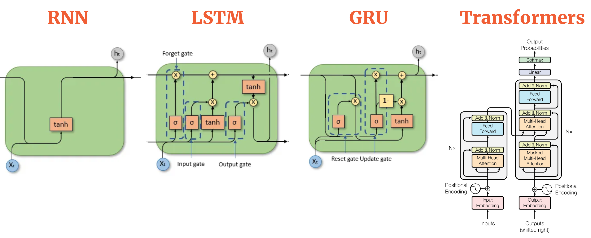
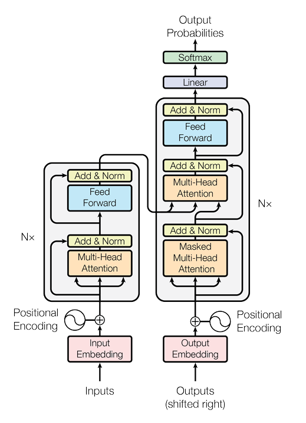

---
title: Attention is all you need and much more
date: 2025-2-15 22:00:00 +0700  
# last_modified_at: 2025-02-11 22:00:00 +0700
categories: [Learning, Paper]  
tags: [en, beginner, reading-paper, llm, ai-learning]  
description: In-depth analysis of transformer.
author: BFC  
image:  
  path: assets/local/transformer.png
math: true

# render_with_liquid: false  
# toc: false  
comments: true  
---  
> This post contains many subjective opinions based on my personal research and understandings, so please take it with a grain of salt.

## Introduction

AI is everywhere right now, isn't it? It feels like every day there's a new mind-blowing model or application making headlines. It's easy to get caught up in the hype, the "AI FOMO" as some call it. But if you're serious about actually understanding this AI revolution, you need to go deeper than just the surface. You need to grasp the core concepts that power these breakthroughs. And when it comes to modern AI, especially in language and vision, one concept stands tall: Attention. Today, we're going back to the source, the paper that arguably started it all: "Attention is All You Need." Get ready for an in-depth exploration of the Transformer architecture.

## Attention Is All You Need
> In the following parts, I will follow the structure of the paper, breaking down the key components and concepts. 

### Introduction
- For years, Recurrent Neural Networks – especially LSTMs and GRUs – reigned supreme in the world of sequence modeling tasks like language translation. (Also, I recommend to know about those models before diving into this paper)
- However, these RNN-based models had a fundamental bottleneck: their inherent sequential nature. Processing information step-by-step, word-by-word, made it difficult to truly parallelize training, especially when dealing with longer sequences. 
- Attention mechanisms have become essential for sequence modeling and transduction, allowing the modeling of dependencies regardless of their distance in the input or output sequences.
- In most cases, attention mechanisms are used in conjunction with a recurrent network.
- This work proposes the **Transformer** model, which **avoids recurrence** and **relies entirely on an attention mechanism** to establish global dependencies between input and output.
{: width="650" .normal}

**Explanation**

**RNN**:

+ Imagine you have a friend who helps you read. This friend is a bit slow. They read the book word by word, from the very first word to the very last word. They have to read each word before they can understand the next one.
+ If the book is super long, it takes your friend a very long time to read it. 
+ It's hard for your friend to remember what happened at the beginning of the book when they are reading the end. 

**Transformer**:
+ Now, imagine you have a super helper! This helper has a magic magnifying glass. When you're reading a sentence, this magnifying glass can quickly jump around and look at the most important words in the sentence, even if they are far apart.
+ This helper is like having lots and lots of magnifying glasses all at once! They can look at all the words in the sentence (or even the whole book!) at the same time and figure out which words are important and how they are all connected to each other.
+ That means: *Super Fast!* *No more forgetting!*

### Model Architecture
Now let's dive into the architecture. Take a look at the diagram below to get a sense of the model's structure, I will explain it in detail in the following sections.
{: height="200"}

#### Encoder-Decoder Architecture
+ The Transformer uses a **stacked encoder-decoder** structure. Both the encoder and decoder are made up of multiple layers (six in this case).
+ Each encoder (the left one in the image) layer consists of two sub-layers: a **multi-head self-attention** mechanism and a position-wise fully connected feed-forward network.
+ The decoder (the right one in the image) layers include an additional sub-layer for **attention over the encoder’s output**, alongside the same two sub-layers present in the encoder.

##### Simple Explanation

+ **The Encoder and Decoder**: Think of the encoder as a "reader" that understands the sentence in one language and creates a representation of it. The decoder is like a "writer" who uses that representation to generate the sentence in another language.

+ **Attention**: The model looks at all the words in a sentence at once and decides which words are most important for understanding the meaning. For example, when translating the word "dog," it might pay extra attention to the word "bark" because dogs bark. This is the "attention" mechanism!

+ **Multi-Head Attention**: The model has multiple "heads" or sets of eyes that look at the sentence in different ways at the same time. This helps it understand various aspects of the sentence. For example, one head might focus on "dog," another on "bark," and a third on "pet," allowing the model to gather more complete information.

+ **Attention over the Encoder's Output**: The decoder doesn't just blindly generate words; it looks back at the encoder’s output to ensure it has all the relevant information from the input sentence. This is like checking the original sentence to ensure it hasn't missed any important details when translating.

##### How the input and output are **actually** processed in the encoder and decoder
> Recommend to read this with the image above

Let's call the input sequence is x. It will be passed through the encoder first.

Into the encoder, x will be pass through a **multi-head attention**, the result is x', and x' will have the same dimension with x. Then we will add x' with x (**residual connection**) and normalize it (**Layer Normalization**). This is the first sub-layer of the encoder. The next sub-layer is a feed-forward neural network, which will be applied to x', give you x'' and then add it with x' again and normalize it. The result x''' will go through the same process with x (this repeat N = 6 times, N is the number of layers in the encoder). After that, we will have the output of the encoder.

Let’s call the output from the encoder (the context-rich representation) as e, and the target sequence being generated as y.
The target sequence y is passed through the first sub-layer of the decoder, which is a **masked multi-head attention mechanism**. The result of this attention is y', which has the same dimensions as y. y' go through residual connection and layer normalization, this produces y''. The next sub-layer in the decoder is **multi-head attention over the encoder’s output** e. The result of this attention is y''', which will go through residual connection and layer normalization, produce y''''.  y'''' will be passed through a feed-forward neural network (residual connection and layer normalization will be applied), and the result will be y''''''. This process repeats N=6 times.

Note that: all **x**'s have the same dimension, all **y**'s have the same dimension.

**Terminology**:
+ Multi-Head Attention: will be explained in the next section. 
+ Layer Normalization: normalizing the output of each layer. Layer normalization helps to manage the internal covariate shift during training, which refers to the change in the distribution of inputs to layers as the model learns. (I recommend to search for it if you don't know about it)
+ Residual connection: a shortcut that allows the output of a layer to bypass the normal processing and be added directly to the output of the layer. This technique, proposed in residual networks (ResNets), is vital for preventing the vanishing gradient problem in deep networks and allowing for easier training.
+ Masked Multi-Head Attention: will be explained in the next section. 
+ Attention over the Encoder's Output (Decoder): will be explained in the next section.

#### Attention Mechanism
This part will explain all the *strange* terminologies in the previous section. This is the core of the Transformer model, so pay close attention!

##### Dot-Product Attention

Imagine you're trying to figure out how much attention each word in a sentence should pay to every other word. Each word is represented by a vector (a list of numbers), and you want to measure how "relevant" one word is to another.

- **The Query** ($$Q$$) represents the word you're currently focusing on.
- **The Key** ($$K$$) represents all other words that might help provide context for the word you're focusing on.
- **The Value** ($$V$$) represents the information you want to extract from each word.

The idea behind **dot-product attention** is simple: You compute how much the **query** matches with the **key** by calculating their **dot product** (a mathematical operation that measures how aligned two vectors are). If the query and key are similar, it means the word is relevant to what you're currently focusing on.

- The **dot product** between the query $$Q$$ and each key $K$ gives a **similarity score**: 
  $$
  \text{Similarity}(Q, K) = Q \cdot K
  $$
- The higher the score, the more relevant that key (and its corresponding value) is to the query.

So, after calculating the dot products, you would use them as **weights** to take a weighted sum of the values $$V$$. This weighted sum is the **output of the attention mechanism**, which tells you which words are most important for understanding the word you're focusing on.

##### Scaled Dot-Product Attention

Now, the problem with just using the **dot product** of the query and key is that, as the **dimensionality** of the vectors (the size of the query/key vectors) increases, the dot product grows larger. This can cause some issues:

- **Large values in the dot product** lead to **sharp gradients** in the softmax function (which is applied to the attention scores to normalize them). This can cause the softmax to become "too extreme", making the model less stable during training.
  
To fix this, the authors **scale** the dot product by dividing it by the square root of the dimension of the key vectors, $$\sqrt{d_k}$$, where $$d_k$$ is the size of the key vectors. The **scaling** makes sure that the values stay in a reasonable range and prevents the softmax from saturating too quickly.

So the **scaled dot-product attention** is:

$$
\text{Attention}(Q, K, V) = \text{softmax}\left(\frac{QK^T}{\sqrt{d_k}}\right) V
$$

- By dividing the dot product by $$\sqrt{d_k}$$, we ensure that the similarity scores don't grow too large and the softmax function behaves more smoothly.

##### Multi-Head Attention

While scaled dot-product attention is great for focusing on relevant words, **multi-head attention** takes this a step further by **looking at the sentence from multiple perspectives** at once. Instead of having just one "set of eyes" (one set of queries, keys, and values), you create several different sets (or "heads") that each look at the sequence in their own unique way.

- **Why multiple heads?**
  - Each attention head can learn to focus on different relationships between words. For example, one head might learn to focus on word order, another might focus on syntactic structures, and another might focus on semantic meaning. By combining all of these different heads, the model can capture more complex patterns in the data.

- **How does it work?**
  - First, we **project** the query, key, and value vectors into **multiple subspaces** (using learned weights), so that each attention head has a unique view of the information.
  - Then, each attention head computes its own attention using the scaled dot-product attention method.
  - Finally, the outputs of all the heads are **concatenated** together and projected back into the original space.

Mathematically, this looks like:

$$
\text{MultiHead}(Q, K, V) = \text{Concat}(\text{head}_1, \dots, \text{head}_h) W^O
$$

Where each head $$i$$ is:

$$
\text{head}_i = \text{Attention}(QW_i^Q, KW_i^K, V W_i^V)
$$

- $$W_i^Q$$, $$W_i^K$$, and $$W_i^V$$ are learned projection matrices that project the query, key, and value vectors for each head into different subspaces.
- The results from each head are concatenated and then projected back into the original space using $$W^O$$.

##### **Applications of Attention in the Transformer**
In the Transformer, attention is used in three different ways:

1. **Self-Attention in the Encoder**: In each encoder layer, **self-attention** allows each token to attend to all other tokens in the same input sequence. This allows each token to gather information from the entire sequence, regardless of their position.

2. **Self-Attention in the Decoder**: In the decoder, **self-attention** works similarly but is modified to prevent attending to future tokens during training. This masking ensures that the decoder generates the output in an autoregressive manner, relying only on previously generated tokens when predicting the next token.

3. **Encoder-Decoder Attention**: The decoder also has an additional layer of attention that allows each token in the decoder to attend to all tokens in the encoder’s output. This ensures that the decoder can use the context from the encoder (which processes the input sequence) to generate the target sequence.

##### Look back at how the input and output are processed in the encoder and decoder
> Recommend to read the previous section first

Okay, now we know what really attention is. Let's look back at how the input and output are processed in the encoder and decoder and explain the *strange* things in the previous section.

In the **encoder**, $$x$$ will go through a **multi-head attention** mechanism first. Now, we can understand this better:

- For each value in $$x$$, say $$x[i]$$ (remember that $$x$$ is just a vector), **$$x[i]$$ will learn from other $$x[j]$$ (also itself)**. This means that $$x[i]$$ can attend to every other word in the sequence (including itself) and decide how much attention it should pay to each word. In simpler terms, it is **self-attention**, where each word gathers context from every other word in the sequence.
  
  This process of **attention** allows the model to focus on the most relevant parts of the sequence to understand the meaning of $$x[i]$$. For example, if $$x[i]$$ is the word "dog", it might focus more on "bark" and less on a word like "a". This happens because the **attention mechanism** computes a score for each word, which determines how much focus $$x[i]$$ should put on other words. The result is a **weighted sum of the values**, which is $$x'$$.

- **Multi-Head Attention**: The advantage of **multi-head attention** is that it doesn't just focus on one interpretation of the context. Instead, it has multiple "heads", each of which looks at the data from a different angle. So, one head might focus on syntactic relations (like subject-verb agreement), another might focus on semantic relations (like understanding which objects "bark"), and yet another might focus on positional relationships. After all these heads have processed the input in parallel, their outputs are combined to form a richer understanding.

- The **residual connection** adds $$x$$ back to $$x'$$, ensuring that the original input information isn't lost and stabilizing the learning process. After this, **Layer Normalization** is applied to normalize the output, ensuring smoother and more efficient training.

Now, let’s move to the **decoder**. The target sequence $$y$$ is passed through the first sub-layer, which is a **masked multi-head attention mechanism**:

- For each value in $$y$$, say $$y[i]$$, the **masked multi-head attention** ensures that $$y[i]$$ can attend to all previous positions in the sequence, but not to future ones. This is crucial because we are generating the output sequence one token at a time, so $$y[i]$$ must only depend on the previous tokens and not on the ones that come after. This masking prevents the model from cheating by looking ahead at the future tokens, and ensures that the model generates each token in an autoregressive manner.

- The **multi-head attention** in the decoder works similarly to the encoder's attention, allowing $$y[i]$$ to attend to all previous positions in the output sequence and gather context. But this time, we are working with a target sequence, and each token in the sequence is dependent on the ones before it. Once this attention is computed, it results in $$y'$$, and the same **residual connection** and **Layer Normalization** are applied to stabilize the training and retain the original information.

- In the next sub-layer of the decoder, **multi-head attention over the encoder’s output** is performed. Here, each $$y[i]$$ will attend to all the words in the encoder's output $$e$$, which contains the context from the input sequence. This means that for every word in the target sequence, the decoder looks back at the entire input sequence (processed by the encoder) to gather relevant information. For example, if the target word is "chien" (French for dog), the decoder might attend to the word "dog" in the encoder’s output.

- Again, we have the **residual connection** and **Layer Normalization** after this attention step, producing $$y'''$$.

- Finally, $$y''''$$ (after all attention steps) is passed through a **feed-forward neural network**, where each token in $$ y''''$$ is processed independently. This step adds further non-linearity and complexity to the model, which is important for learning complex patterns. The output is again subjected to **residual connection** and **Layer Normalization**, resulting in the final output $$y''''''$$.

## Continue...

<!-- ## Why transformers matters
Certainly! Here are some additional aspects of the Transformer model that are not covered in the above text:

- **Handling Long-Range Dependencies**: Traditional RNN-based models like LSTMs and GRUs struggle with capturing long-range dependencies in sequences due to their sequential nature and vanishing gradient problems. The Transformer, with its self-attention mechanism, is able to capture long-range dependencies more effectively, as it allows the model to attend to all positions in the sequence simultaneously, without the issue of vanishing gradients.

- **Efficiency in Parallelization**: Unlike RNNs, which process inputs sequentially, the Transformer processes entire sequences at once. This means that all positions in the input sequence can be processed simultaneously (in parallel), drastically improving training speed and efficiency. This parallelization also allows for better scaling with hardware resources like GPUs and TPUs.

- **Scalability**: The Transformer model is highly scalable and can handle very large datasets and long sequences, making it a good fit for tasks like machine translation, text summarization, and other NLP tasks involving large amounts of data. This scalability has made Transformers the backbone of many large-scale models such as BERT, GPT, and T5.

- **Flexibility for Various Tasks**: While RNNs were initially designed for tasks with sequential dependencies (such as language modeling), Transformers have proven to be flexible across a variety of tasks, including both supervised and unsupervised learning. Transformers have been adapted for use in tasks such as text generation, text classification, and question answering.

- **Reduced Training Time and Better Generalization**: By leveraging multi-head self-attention and positional encoding, Transformers achieve better performance with fewer training steps, often surpassing traditional RNN-based models. Furthermore, Transformers tend to generalize better, making them more robust to overfitting.

- **No Need for Recurrence**: The lack of recurrence in the Transformer model allows for more stable gradients during training. This is particularly important for tasks that require learning over very long sequences, as it avoids the problem of long-range dependencies being diluted or forgotten as they are passed through many time steps in recurrent models.

- **Adaptability to Multimodal Data**: Although Transformers were originally designed for text, they have been successfully adapted to other modalities, such as images, video, and speech, using techniques like Vision Transformers (ViT) for image recognition and Speech Transformers for speech processing.

- **Bidirectional Contextualization**: In models like BERT, the Transformer architecture is used to obtain a bidirectional understanding of the context. Unlike unidirectional models, where the context is built from one direction (usually left-to-right), bidirectional models can consider both the left and right context simultaneously, leading to better understanding and prediction capabilities.

These points highlight the Transformer model's versatility and its ability to overcome limitations inherent in traditional RNN-based architectures. The key innovation of the self-attention mechanism is a core reason why it has become the dominant architecture in natural language processing and beyond. -->
